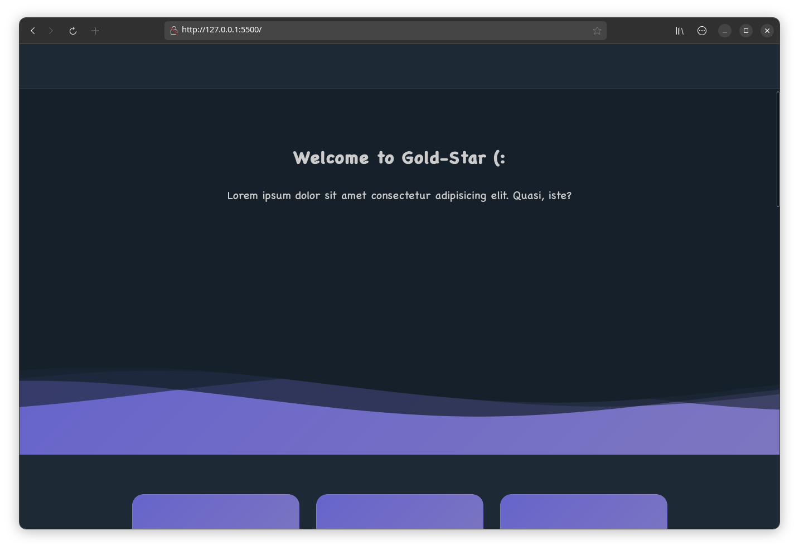

  
Persian README
 
  

    <table align="center">
      <tr align="center">
        <th>عنوان</th>
        <th>توضیحات</th>
      </tr>
      <tr align="center">
        <td>هدر موج دار</td>
        <td>هدر با ایده برای طراحی سایت ⌛</td>
      </tr>
      <tr>
        <td colspan="2"> 
          
        </td>
      </tr>
      <tr>
        <th colspan="2" align="right">🤝 مشارکت</th>
      </tr>
      <tr>
        <td colspan="2" dir="rtl" align="right">این پروژه تحت پروانه GPL نسخه 3 منتشر و نگه‌داری می‌شود و از این‌جهت، هرکسی می‌تواند در صورت نیاز اقدام به مشارکت برای اصلاح یا بهبود یا حتی اضافه کردن ویژگی های جدید به این پروژه کند، همچنین ایجاد فورک های مختلف از پروژه و توسعه پروژه در شاخه‌ای جدا، چه به‌صورت رایگان و چه به‌صورت تجاری، هیچگونه مانعی ندارد</td>
      </tr>
    </table>
  
 

  
English README
 
  

    <table align="center">
      <tr align="center">
        <th>Title</th>
        <th>Description</th>
      </tr>
      <tr align="center">
        <td>Wave Header</td>
        <td>A header with an idea for designing websites ⌛</td>
      </tr>
      <tr>
        <td colspan="2"> 
          
        </td>
      </tr>
      <tr>
        <th colspan="2" align="left">🤝 participation</th>
      </tr>
      <tr>
        <td colspan="2">This project is released and maintained under the GPL version 3 license, and in this sense, anyone can contribute to modify or improve or even add new features to this project, as well as create different forks of the project and develop the project in A separate branch, whether free or commercial, has no obstacles</td>
      </tr>
    </table>
  

